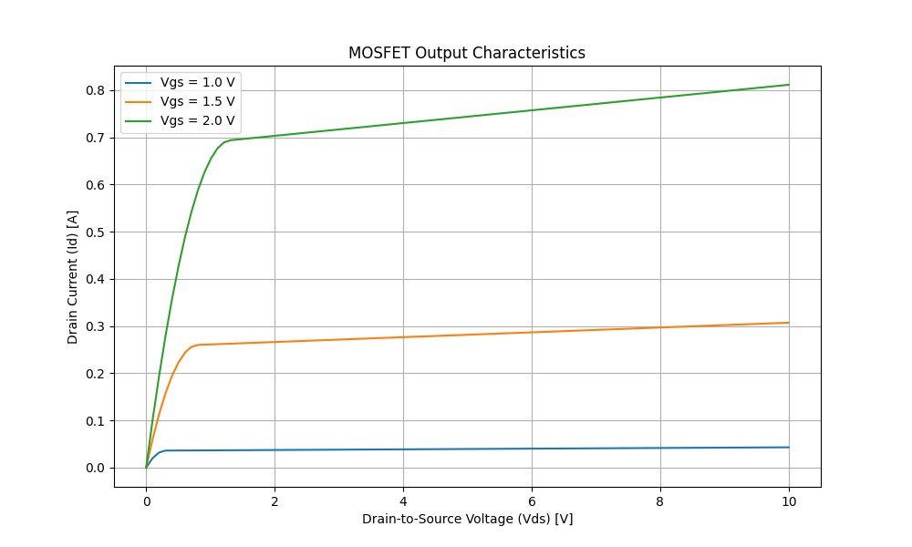

# MOSFET Output Characteristics Simulator

This Python script simulates and plots the output characteristics (Id vs Vds) of a MOSFET for different gate-to-source voltages (Vgs).

## Output Example



## Features
- Models MOSFET operation in cut-off, linear, and saturation regions
- Configurable parameters: Vth, k, λ
- Generates professional-looking plots
- Command-line interface for easy parameter adjustment

## Installation
1. Clone this repository
2. Create a virtual environment: `python -m venv venv`
3. Activate the environment: `source venv/bin/activate` (Linux/Mac) or `venv\Scripts\activate` (Windows)
4. Install dependencies: `pip install -r requirements.txt`

## Usage
Run the simulation with default parameters:
```bash
python mosfet.py


